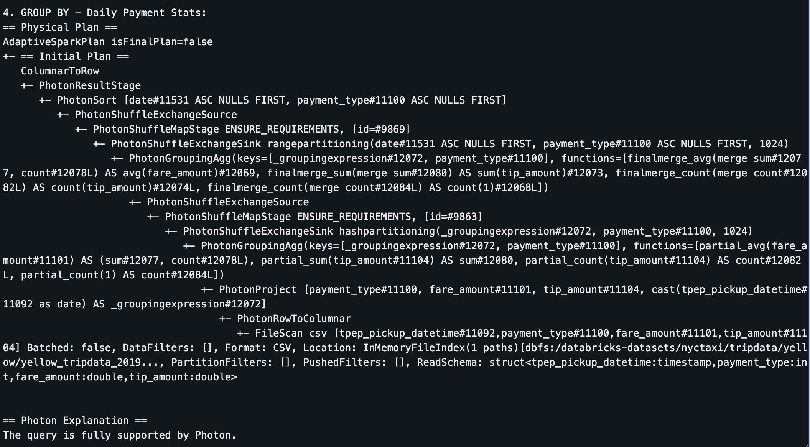
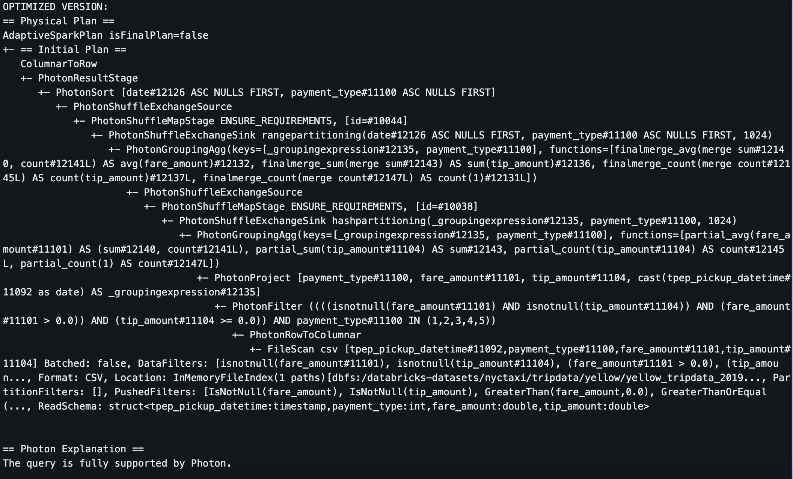
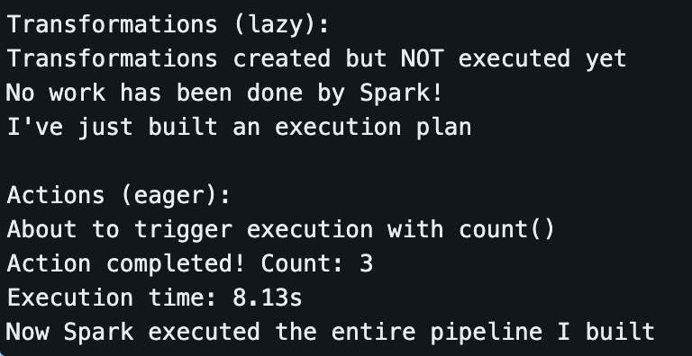
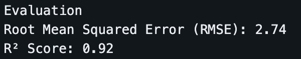
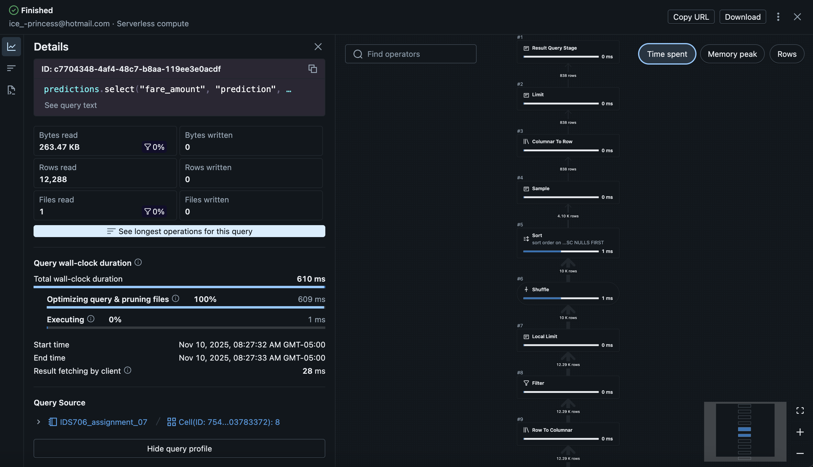

# IDS706_assignment_07
This is a repository for [assignment 7: PySpark Data Processing](https://canvas.duke.edu/courses/60978/assignments/299525)

I built a data pipeline using PySpark to work with NYC taxi trip data. This shows how to handle large datasets with Spark and make things run faster.

### About the data
I used the NYC taxi dataset that comes with Databricks. It's got:
- Pickup and dropoff times and locations
- How many passengers were in the taxi
- How far each trip went
- How much people paid and tipped
- Different payment types

The data covers December 2019 and has about 6,896,317 taxi rides.


### Performance Analysis

#### Before pipeline optimization



Spark optimized the query using Photon acceleration and two-stage aggregation for parallel processing. Column pruning automatically selected only necessary columns. No filter pushdown occurred during data loading, which caused full dataset scans.

Key bottlenecks included double shuffling from `GROUP BY` and `ORDER BY` operations, creating network overhead. 

Optimizations focused on early filtering to remove invalid records before aggregation and explicit column selection to enhance pruning. These changes reduced data shuffling and eliminated unnecessary processing throughout the pipeline.

#### After pipeline optimization



Due to the pipeline optimization, it successfully enabled filter pushdown, allowing Spark to apply data filters directly during the dataset reading. The physical plan now showed PushedFilters containing all my conditions, invalid records were eliminated early in the pipeline. 

> Caching was unavailable in Databricks Serverless


### What I found in the data

#### Actions vs transformations 

I noticed how Spark is lazy, it doesn't do any work until I tell it to give me the results.

```python
# 1. Transformations
print("Transformations (lazy):")
df_filtered = df.filter(col("trip_distance") > 5)
df_with_column = df_filtered.withColumn("double_distance", col("trip_distance") * 2)
df_grouped = df_with_column.groupBy("VendorID").agg(avg("trip_distance"))

print("Transformations created but NOT executed yet")
print("No work has been done by Spark!")
print("I've just built an execution plan")

# 2. Actions
print("\nActions (eager):")
print("About to trigger execution with count()")

start_time = time.time()
count_result = df_grouped.count()
execution_time = time.time() - start_time

print(f"Action completed! Count: {count_result}")
print(f"Execution time: {execution_time:.2f}s")
print("Now Spark executed the entire pipeline I built")
```



The first part happens instantly because Spark just makes a plan. The `.count()` takes a few seconds because that's when the real work happens.


#### Predicting taxi fares
I built a simple machine learning model to predict taxi fares based on:
- How far the passenger is going
- How long the trip takes
- How many people are riding
- Where the passenger is getting picked up



### Other evidence
